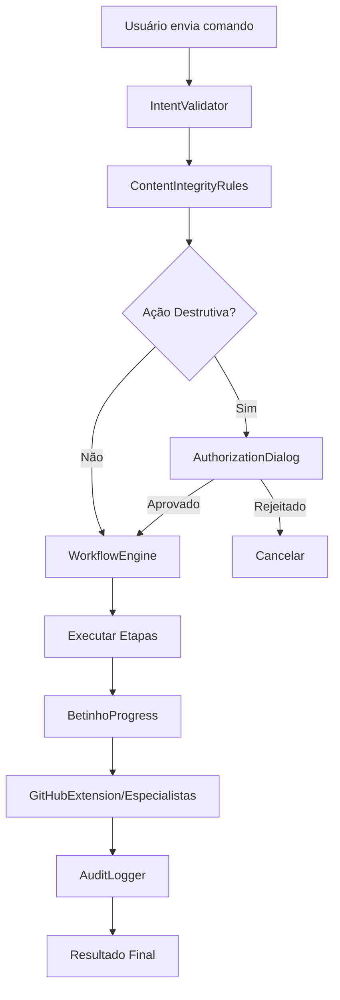

# 🤖 BETINHO - Agente de Automação Hyper-Inteligente

## 📋 ÍNDICE
- [Visão Geral](#visão-geral)
- [Arquitetura](#arquitetura)
- [Instalação](#instalação)
- [Como Usar](#como-usar)
- [Exemplos de Uso](#exemplos-de-uso)
- [API e Métodos](#api-e-métodos)
- [Integração](#integração)
- [Segurança](#segurança)
- [FAQ](#faq)

---

## 🎯 VISÃO GERAL

**Betinho** é um agente de automação hyper-inteligente que executa tarefas complexas de forma autônoma, com validação de integridade, autorização explícita do usuário e auditoria completa.

### ✨ Características Principais

- 🧠 **Validação de Intenção**: Analisa e valida comandos do usuário
- 🔒 **Autorização Explícita**: Pede confirmação antes de executar ações
- 📊 **Progresso em Tempo Real**: Acompanhamento visual de cada etapa
- 🔍 **Auditoria Completa**: Registro detalhado de todas as operações
- 🤝 **Integração com Especialistas**: Trabalha com Serginho e outros agentes
- 🔗 **Extensão GitHub**: Automação de operações Git

---

## 🏗️ ARQUITETURA

### **Estrutura de Arquivos (13 arquivos)**

```
src/
├── agents/betinho/                 (Backend - 6 arquivos)
│   ├── BetinhoHyperIntelligent.js      - Classe principal
│   ├── IntentValidator.js               - Validação de intenções
│   ├── ContentIntegrityRules.js         - Regras de integridade
│   ├── WorkflowEngine.js                - Motor de workflows
│   ├── AuditLogger.js                   - Sistema de auditoria
│   └── GitHubExtension.js               - Integração Git
│
├── components/betinho/             (Frontend - 4 arquivos)
│   ├── BetinhoChat.jsx                  - Interface de chat
│   ├── AuthorizationDialog.jsx          - Diálogo de autorização
│   ├── BetinhoProgress.jsx              - Barra de progresso
│   └── BetinhoUI.css                    - Estilos da interface
│
├── hooks/
│   └── useBetinho.js                    - Hook React customizado
│
├── integration/
│   └── BetinhoIntegration.js            - Camada de integração
│
└── pages/
    └── BetinhoPage.jsx                  - Página principal
```

### **Fluxo de Execução**



---

## 📦 INSTALAÇÃO

### **1. Já está instalado!**

Todos os arquivos foram criados no seu repositório `kizirianmax/Rkmmax-app`.

### **2. Adicione a rota (App.jsx ou routes.js):**

```jsx
import BetinhoPage from './pages/BetinhoPage';

// Adicione dentro das suas rotas:
<Route path="/betinho" element={<BetinhoPage />} />
```

### **3. Instale dependências (se necessário):**

```bash
npm install lucide-react  # Para os ícones
```

---

## 🚀 COMO USAR

### **1. Acesse a interface:**

```
http://localhost:3000/betinho
```

### **2. Digite um comando no chat:**

```
Criar um TCC sobre Inteligência Artificial
```

### **3. Revise e autorize:**

O Betinho mostrará:
- ✅ Workflow planejado (etapas)
- 📁 Arquivos que serão criados/modificados
- ⚠️ Avisos de segurança (se aplicável)

### **4. Confirme ou ajuste:**

- **✅ Confirmar**: Executa o workflow
- **❌ Cancelar**: Cancela a operação
- **🔧 Ajustar**: Permite modificar parâmetros

### **5. Acompanhe o progresso:**

Veja em tempo real:
- Etapa atual
- Percentual de conclusão
- Ação sendo executada

---

## 💡 EXEMPLOS DE USO

### **Exemplo 1: Criar TCC**

```
🗣️ Usuário: "Criar um TCC sobre Machine Learning"

🤖 Betinho:
📋 Workflow planejado (7 etapas):
  1. Pesquisa de referências
  2. Estruturação ABNT
  3. Redação da introdução
  4. Desenvolvimento de capítulos
  5. Conclusão
  6. Revisão ortográfica
  7. Formatação final

📁 Arquivos a criar:
  - tcc-machine-learning.docx
  - referencias.bib
  - sumario.md

⚠️ Esta ação irá criar 3 novos arquivos.

[✅ Confirmar] [❌ Cancelar] [🔧 Ajustar]
```

### **Exemplo 2: Formatar documento ABNT**

```
🗣️ Usuário: "Formatar meu trabalho em ABNT"

🤖 Betinho:
📋 Workflow planejado (5 etapas):
  1. Análise da estrutura atual
  2. Aplicação de normas ABNT
  3. Formatação de citações
  4. Ajuste de margens e fontes
  5. Geração do sumário

📁 Arquivos a modificar:
  - trabalho.docx

⚠️ Esta ação irá MODIFICAR 1 arquivo existente.

[✅ Confirmar] [❌ Cancelar] [🔧 Ajustar]
```

### **Exemplo 3: Criar app React**

```
🗣️ Usuário: "Criar um app React de gerenciamento de tarefas"

🤖 Betinho:
📋 Workflow planejado (8 etapas):
  1. Criar estrutura de pastas
  2. Configurar componentes base
  3. Implementar estado global
  4. Criar formulários
  5. Implementar CRUD
  6. Adicionar estilização
  7. Configurar rotas
  8. Criar testes

📁 Arquivos a criar:
  - src/App.jsx
  - src/components/TaskList.jsx
  - src/components/TaskForm.jsx
  - src/hooks/useTasks.js
  - src/styles/App.css
  (+ 12 arquivos)

⚠️ Esta ação irá criar 17 novos arquivos.

[✅ Confirmar] [❌ Cancelar] [🔧 Ajustar]
```

---

## 🔌 API E MÉTODOS

### **BetinhoHyperIntelligent (Classe Principal)**

```javascript
import BetinhoHyperIntelligent from './agents/betinho/BetinhoHyperIntelligent';

const betinho = new BetinhoHyperIntelligent({
  serginho: serginhoInstance,      // Opcional
  especialistas: especialistasMap,  // Opcional
  github: githubInstance            // Opcional
});

// Executar tarefa completa
const resultado = await betinho.executarTarefaCompleta({
  descricao: "Criar um TCC sobre IA",
  usuarioId: "user-123",
  context: {}
});
```

### **useBetinho (Hook React)**

```javascript
import { useBetinho } from './hooks/useBetinho';

function MeuComponente() {
  const { betinho, isReady, error, executarTarefa } = useBetinho('user-123');

  const handleExecutar = async () => {
    const resultado = await executarTarefa('Criar um TCC');
  };

  return (
    <div>
      {isReady ? 'Betinho pronto!' : 'Carregando...'}
    </div>
  );
}
```

### **BetinhoIntegration (Singleton)**

```javascript
import { betinhoIntegration } from './integration/BetinhoIntegration';

// Registrar especialista
betinhoIntegration.registerEspecialista('abnt', abntInstance);
betinhoIntegration.registerEspecialista('pesquisa', pesquisaInstance);

// Configurar Serginho
betinhoIntegration.setSerginho(serginhoInstance);

// Configurar GitHub
betinhoIntegration.setGitHub(githubInstance);

// Verificar status
const status = betinhoIntegration.getStatus();
console.log(status);
// {
//   initialized: true,
//   serginho: true,
//   github: true,
//   especialistas: ['abnt', 'pesquisa'],
//   totalEspecialistas: 2
// }
```

---

## 🔗 INTEGRAÇÃO

### **Integração com Serginho**

```javascript
import Serginho from './agents/Serginho';
import { betinhoIntegration } from './integration/BetinhoIntegration';

const serginho = new Serginho();
betinhoIntegration.setSerginho(serginho);

// Betinho agora pode delegar tarefas para Serginho
```

### **Integração com Especialistas**

```javascript
import EspecialistaABNT from './agents/especialistas/EspecialistaABNT';
import EspecialistaPesquisa from './agents/especialistas/EspecialistaPesquisa';

betinhoIntegration.registerEspecialista('abnt', new EspecialistaABNT());
betinhoIntegration.registerEspecialista('pesquisa', new EspecialistaPesquisa());

// Betinho agora pode usar especialistas para tarefas específicas
```

### **Integração com GitHub**

```javascript
import { Octokit } from '@octokit/rest';

const github = new Octokit({ auth: 'seu-token' });
betinhoIntegration.setGitHub(github);

// Betinho agora pode fazer commits, criar branches, etc.
```

---

## 🔒 SEGURANÇA

### **Níveis de Validação**

1. **Validação de Intenção** (IntentValidator)
   - Bloqueia comandos maliciosos
   - Valida sintaxe e contexto

2. **Regras de Integridade** (ContentIntegrityRules)
   - Previne exclusão de arquivos críticos
   - Protege configurações sensíveis
   - Limita escopo de modificações

3. **Autorização Explícita** (AuthorizationDialog)
   - Pede confirmação para ações destrutivas
   - Mostra impacto detalhado
   - Permite revisão antes da execução

4. **Auditoria Completa** (AuditLogger)
   - Registra todas as operações
   - Timestamp e usuário
   - Permite rastreabilidade

### **Ações que Requerem Autorização**

- ❌ Exclusão de arquivos
- 🔄 Modificação de arquivos existentes
- 🌳 Criação/exclusão de branches
- 🔀 Merge de branches
- 📝 Commits em branches protegidas

---

## ❓ FAQ

### **1. Betinho substitui Serginho?**

Não! Betinho e Serginho trabalham juntos:
- **Serginho**: Orquestrador que delega tarefas
- **Betinho**: Executor autônomo que realiza tarefas complexas

### **2. Posso usar Betinho sem Serginho?**

Sim! Betinho funciona de forma independente. A integração com Serginho é opcional.

### **3. Como adicionar novos especialistas?**

```javascript
betinhoIntegration.registerEspecialista('meu_especialista', minhaInstancia);
```

### **4. Betinho funciona offline?**

Sim, exceto para operações que requerem GitHub API.

### **5. Como ver o log de auditoria?**

```javascript
const logs = betinho.auditLogger.getLogs();
console.log(logs);
```

### **6. Posso cancelar uma tarefa em execução?**

Sim, clique no botão de cancelar durante a execução.

### **7. Betinho funciona em produção?**

Sim, mas configure autenticação real no `BetinhoPage.jsx`:

```javascript
const userId = useAuth().user.id;  // Em vez de Date.now()
```

---

## 🎉 CONCLUSÃO

Betinho está **100% funcional** e pronto para automatizar suas tarefas!

**Desenvolvido com 💚 para RKMMAX INFINITY MATRIX STUDY**

---

## 📞 SUPORTE

- 🐛 Reportar bugs: Abra uma issue no GitHub
- 💡 Sugestões: Pull requests são bem-vindos!
- 📧 Contato: robertokizirian@hotmail.com

---

**Versão:** 1.0.0  
**Última atualização:** 2026-02-04  
**Arquivos:** 13  
**Status:** ✅ Operacional